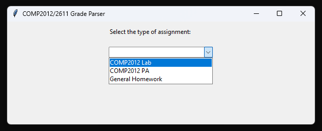
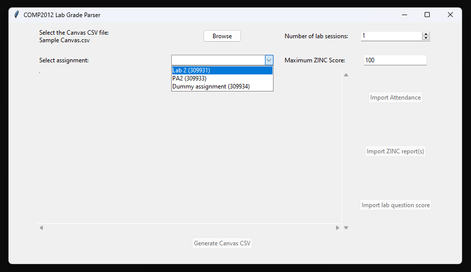
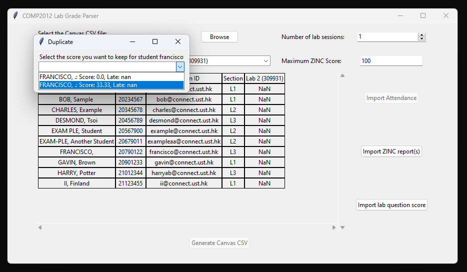
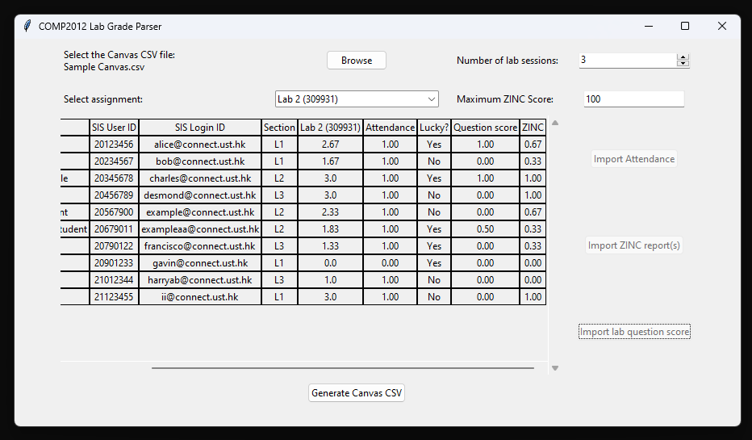

# GradeParser

This project is intended for use by the HKUST COMP Teaching Team.
Automates the process of parsing scores from gradesheets into Canvas gradebook.

## Usage

Download the executable file from Release section, or run the Python script manually:

```
python ./src/main.py
```

## Instructions

Download the following files to process the scores of some assignment:
- Latest Canvas gradebook CSV
- Gradesheets for the assignment.

Upon launching the program, select the type of assignment.



The following is an example of COMP2012 Lab score parsing. The other types follow the similar steps.

Import the Canvas CSV file and select the assignment. Columns with the most number of blanks are available for import.



For labs, the following sheets need to be imported:
- Attendance sheet
- ZINC gradesheets, one for each lab session
- Question score sheet

Before importing ZINC gradesheets, set the maximum score for scaling purpose. If duplicated entries are found,
select one of the available options to keep. The number of lab sessions should automatically update based on
the number of ZINC gradesheets.



After importing all sheets, the total score and components can be viewed, and the new Canvas CSV is ready to be exported.



## TODO
- Allow selection of any assignment in Canvas CSV
- Implement JPlag for COMP2012 PA

